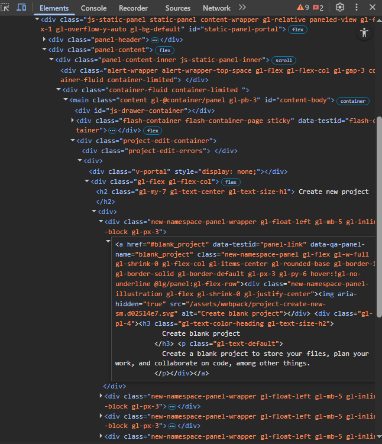

## Summary (Summarize the bug encountered concisely)

    When accessing the GitLab website, and being logged in, typically users will create a project to get started. However, when a user goes to the New projects page (https://gitlab.com/projects/new) in the button card to "create blank project" it instead says "create black project", this bug is a typo and can lead to misinformation and misunderstanding to the user. 
  
## Steps to reproduce     
    If not logged in first

    Navigate to Login page (https://gitlab.com/users/sign_in)
    Input user credentials to be authenticated
    Continue steps from below

    Assuming if logged in

    Navigate to Projects page (https://gitlab.com/projects/new)
    Verify 4 clickable cards for different options in Create New Project
    Top left Card states "create black project" (bug encounter)

## What is the current bug behavior?

    Current bug behavior is the typo of a card that must be clicked for the user to create a blank project. The text should read "Create blank project" instead it reads "Create black project" when user is making selection for the beginning stages of project creation. This does not affect main functionality of button, but the UI/UX and the misleading info of the function.
     

## What is the expected correct behavior?

    The expected correct behavior is for the text to be "create blank project" this is because when clicking the card this is the exact function that occurs, where it creates a blank template for the user to use for a project. By stating "black" user may misunderstand the potential function of clicking on the card.

     
## Relevant logs and/or screenshots

    Incased within this folder is photos demonstrating the bug and the expected behavior

      

## Possible fixes

    Possible fixes include correcting the text element within the HTML file assuming it is hard written into the DOM. If the text is injected through DOM maniuplation then, locating the incorrect string "Create black project" and rewriting it to the correct expected behavior "Creating blank project". Once change has been made, verify no other issues caused by fix such as regression issues, and verify that fix was made for all supported browsers and languages. For example, the below image shows the console opened on the elements section to show HTML code of the projects page. In this section may be the required change to the typo in this hypothetical scenario
    

## Whom do you report/ Assign To/ Tags

    This bug deals with the UI/UX of the webpage specifically, a text typo, thus it should be handled by the frontend development team of GitLab, or if specifically any groups managing these direct pages in accessibility, UI/UX. If the webpages were done by freelancers then which ever handles the web development team, such teams like full stack that deal with both frontend and backend may not be needed for a minor bug.
    I would report this bug to the team directly, or the manager of the team, but since not pressing issue would not need higher positions consent to fix the issue.

    Similar to template style tags

    /label ~bug ~minor ~ux ~ui ~text-typo ~project-creation
    /cc @Frontend-development-team, @Web-development-team, @Team-manager
    /assign @Frontend-developer, @web-developer, @UX/UI-designer

## Priority

    The priority of this bug is minor, as it does not affect any critical functionalities of the Webapp. However I would not consider it trivial as it is still part of the UI of the site, and a highly frequented web page when people need to create a project. Thus because the functionality remains the same of creating a blank template when clicked, the bug may produce misinformation to users, especially new users when attempting to understand which each does, resulting in a minor bug.
